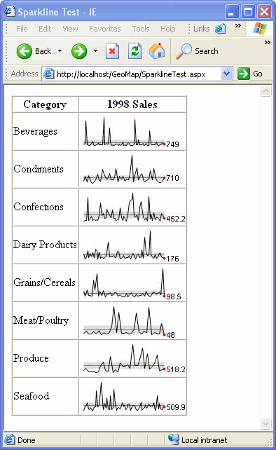

# SparkLines

Originally posted here:
https://www.codeproject.com/Articles/18944/SparkLines

SparkLine is a small, high resolution line chart. This article explains how to create and use SparkLines in your ASP.NET application.

## Introduction
Spark lines is this really cool way to visualize information. They are small high resolution line charts that show you where things are heading. Note that they don't show any detailed data, but only the general trend. This article explains how to create and use spark lines in your ASP.NET application.

## Using the code
An ASP.NET page (sparkline.aspx) is producing the binary output to generate the image. The data enters the page via URL parameters.

The table below shows the list of parameters that the image page (sparkline.aspx) can accept.

| Parameter | Description | Sample Data |
| -------- | ------- | ------- |
| data | Comma delimited data to be visualized | 1,10,10,1
| StdDev | Standard Deviation Band | 1-show, 0-hide |
| bgcolor | Background color | yellow |
| avgcolor | Average line color | red |
| linecolor | Line color | red |
| top | Top margin | 5 |
| bottom | Bottom margin | 5 |
| left | Left margin | 5 |	
| right | Right margin | 5 |	
| width | Chart width | 200 |	
| height | Chart height | 60 |	

Another ASP.NET page (SparklineTest.aspx) reads the SQL Server 2000 Northwind database and builds a dynamic table based on the data. It passes the sales information for each day to the SparkLines image page (sparkline.aspx).

## Points of interest
You can read more about SparkLines on Edward Tufte's website. 
http://www.edwardtufte.com/bboard/q-and-a-fetch-msg?msg_id=0001OR&topic_id=1

